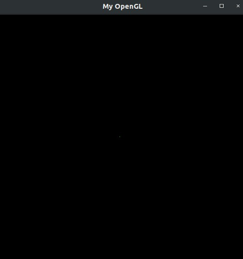
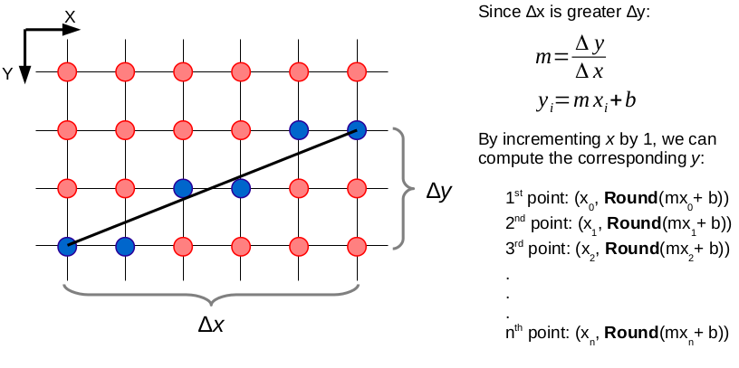
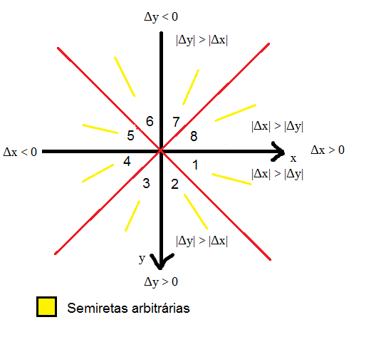
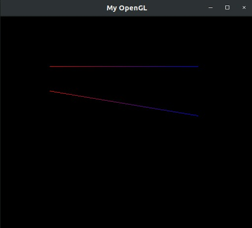
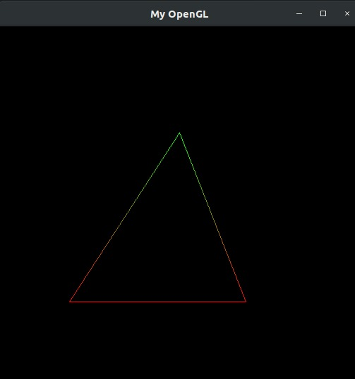

Introdução á Computação Gráfica - Trabalho I
---

Disciplina: [GDSCO0051] Introdução à Computação Gráfica - Turma 02.

Professor: Christian Azambuja Pagot (email: christian@ci.ufpb.br).

Alunas: 
        
        Ana Flavia S. Aragão Moura; 20160164270

        Thuane Mikaella de França; 11325835

---

## Índice

* [Introdução](#introdução)
* [Setup](#setup)
* [Pixels](#pixels)
	* [Ponto](#ponto)
* [Algoritmo de Bresenham](#algoritmo-de-bresenham)
	* [Linha](#linha)
	* [Triângulo](#triângulo)
* [Conclusão](#conclusão)
* [Referências Bibliográficas](#referências-bibliográficas)

---


### Introdução
Este trabalho foi desenvolvido para a disciplina de Introdução à Computação Gráfica, ministrada pelo Prof. Dr. Christian Azambuja Pagot na Universidade Federal da Paraíba, UFPB. 

Com o objetivo de nos familiarizar com os algoritmos de rasterização utilizados em computação gráfica. Aprendemos na prática como rasterizar pontos, linhas e triângulos através da rasterização das linhas.

Simulando o acesso direto a memória de vídeo utilizando um framework, fornecido pelo professor, que simula o acesso à memória de vídeo. 

---


### Setup

Utilizamos o sistema operacional Linux distribuição Unbuntu 18.04.04 LTS. Para a compilação exige  requisitos do OpenGL e o GLUT (The OpenGL Toolkit) sejam armazenados. Após a instalação:

```sh
$ make

$ ./cgprog
```


### Pixels

Os monitores da atualidade são compostos por uma malha de pixels, formando um espaço bidimensional. Porém, a disposição desses pixels na memória de vídeo se dá de forma linear, onde todos os pixels são armazenados de forma contínua no que chamamos de *colour buffer*.Assim, é necessário calcular um offset para que cada pixel da tela, dada sua posição (x,y) ocupe um único e distinto espaço em memória. Este fato deve ser levado em consideração quando se trabalha com a manipulação de pixels.

A maioria dos monitores no mercado utilizam o padrão RGBA, onde cada pixel possui 4 componentes de cor: R para vermelho (RED), G para verde (GREEN), B para azul (BLUE) e A para transparência (ALPHA). Cada componente ocupa 1 byte do *colour buffer*, totalizando 4 bytes por pixel. O esquema de Image Storage está exemplificado na imagem apresentada:


<p align="center">
	<br>
	
	<h5 align="center">Figura 1 - Disposição dos pixels na memória</h5>
	<br>
</p>

Portanto, podemos de endereçar cada pixel (e cada canal de cor) no *colour buffer* da seguinte forma:

<p align="center">
	<br>
	
	<h5 align="center">Figura 2 - Endereçamento de pixels no colour buffer</h5>
	<br>
</p>

### Ponto


```Desenvolvimento Função: PutPixel(...): Rasteriza um ponto na memória de vídeo recebendo como parâmetros as coordenadas (x,y) do pixel na tela e sua cor (RGBA).```


O primeiro passo é conseguir rasterizar um pixel na tela, pois uma imagem é formada por um conjunto de pixels. Como alterações à memória de vídeo são restritas pelo sistema operacional, o acesso foi simulação pelo ponteiro FBptr, através do framework desenvolvido pelo Professor.

Foi implementado um tipo estruturado **pixel** contendo todas as informações de coordenadas e cores dele:

```C++
typedef struct {
	int red;
	int green;
	int blue;
	int alpha;
} tColor;

typedef struct {
	int x;
	int y;
} tPixel;
```

A fim de desenhar um pixel na tela, foi criada a função **putPixel()** que recebe como parâmentro um pixel (com suas informações coordenadas e de cor) e rasteriza um ponto na tela. No framework desenvolvido pelo professor, existe um ponteiro **FBptr** que aponta para a primeira posição do *colour buffer*, e isso possibilitou a implementação de tal função:

``` C++
void putPixel(tPixel ponto,tColor cor){
     int pos = 0;
     if (ponto.posx >= 0 && ponto.posx <=IMAGE_WIDTH &&ponto.posy >=0 && ponto.posy <= IMAGE_HEIGHT){

    		pos = (IMAGE_WIDTH*ponto.posy + ponto.posx)*4;
    		FBptr[pos]   = cor.R;
    		FBptr[pos+1] = cor.B;
    		FBptr[pos+2] = cor.G;
    		FBptr[pos+3] = cor.A;
    }
}
```
Obtivemos esses resultados:


<p align="center">
	<br>
	
	<h5 align="center">Figura 3 - Função PutPixel()</h5>
	<br>
</p>


### Algoritmo de Bresenham

A etapa mais complicada do projeto foi a rasterização de linhas. Para isso, foi criada a função **drawLine()**, que recebe dois pixels como parâmetro, e desenha uma reta aproximada entre eles.

Para essa função foi utilizado o algoritmo de Bresenham, muito utilizado na computação para rasterização de linhas. O algoritmo de Bresenham, de forma simplificada, busca aproximar uma reta (que sabemos que é contínua), para um universo discreto. Para isso, transforma-se a linha a ser desenhada em uma equação de reta, da forma y = mx + b.

A cada incremento de x, y incrementa baseado na inclinação m. Isso, porém, quer dizer que y assumirá valores de pontos flutuante, o que dificulta a representação por meio de pixels. O algoritmo de Bresenham chega então na etapa de decisão: a cada vez que x muda, verifica-se se o valor de y equivalente está mais próximo do y atual, ou de y + 1. Após a decisão, o pixel escolhido é acendido. Isso pode ser visto de uma forma melhor na seguinte imagem: 

<p align="center">
	<br>
	
	<h5 align="center">Figura 4 - Linha de Bresenham </h5>
	<br>
</p>

Porém, da forma apresentada, o algoritmo funciona apenas para linhas no primeiro octante. Isso é, o octante em que o deslocamento em xe y são positivos, e a inclinação da reta está entre 0º e 45º graus. 

<p align="center">
	<br>
	
	<h5 align="center">Figura 5 - Octantes </h5>
	<br>
</p>

### Linha

```Desenvolvimento Função: DrawLine(...): Rasteriza uma linha na tela, recebendo como parâmetros as coordenadas dos seus vértices inicial e final (representados respectivamente pelas tuplas (x0,y0) e (x1,y1)) e as cores (no formato RGBA) de cada vértice. As cores dos pixels ao longo da linha rasterizada devem ser obtidas por meio de interpolação linear das cores dos vértices. ```

Para a implementação funcionar para qualquer reta, foi necessário generalizar o algoritmo. O primeiro if desenha linhas em que o deslocamento x é maior do que deslocamento y. Isso é, nos octantes 1, 4, 5, e 8. Por consequência, o else é responsável pelos octantes 2, 3, 6, e 7. O algoritmo foi implementado da seguinte forma: 

```C++
void drawLine(tPixel pixel1,tPixel pixel2,tColor cor1,tColor cor2){
    int oct;
    int dX = (pixel2.posx - pixel1.posx);
    int dY = (pixel2.posy - pixel1.posy);
    float distP;//distancia parcial do pixel inicial até o pixel final
    float distT = dist(pixel1,pixel2);//comprimento da reta
    int inclinacao;//da reta
    //Algoritmo de Braseham pra todos os octantes
    //
    if(dX<0)
    {
        drawLine(pixel2,pixel1,cor2,cor1);
        return;
    }
    if(dY<0)
        inclinacao = -1;
    else
        inclinacao = 1;

    int incE, incNE, d;//constantes de Braseham's
    tPixel pixel = pixel1;
    tColor cor = cor1;

    putPixel(pixel1,cor1);
```

Essa é a parte inicial da função, que vai definir em qual octante será desenhada linha, baseado nos pixels passados como parâmetro. Também é criado o pixel "linha", que será nosso pixel "ambulante". Isso é, será ele que percorrerá a linha, mudando de coordenadas, e pintando cada pixel.

```C++
    if(dX >= inclinacao*dY){//m<=1
        if(dY<0){
            d = 2*dY+dX;
            while(pixel.posx<pixel2.posx){
                if(d<0){
                    d += 2*(dY+dX);
                    pixel.posx++;
                    pixel.posy--;
                }
                else{
                    d+=2*dY;
                    pixel.posx++;
                }
                distP = dist(pixel,pixel2);
                cor = interpolColor(distP/distT,cor1,cor2);
                putPixel(pixel,cor);
            }
        }
        else{
            d=2*dY-dX;
            while(pixel.posx<pixel2.posx){
                if(d<0){
                    d+=2*dY;
                    pixel.posx++;
                }
                else{
                    d+=2*(dY-dX);
                    pixel.posx++;
                    pixel.posy++;
                }distP = dist(pixel,pixel2);
                cor = interpolColor(distP/distT,cor1,cor2);
                putPixel(pixel,cor);
            }
        }
    } else{ //m>1
        if(dY<0){
            d=dY+2*dX;
            while(pixel.posy > pixel2.posy){
                if(d<0){
                    d += 2*dX;
                    pixel.posy--;
                }
                else{
                    d+=2*(dY+dX);
                    pixel.posx++;
                    pixel.posy--;
                }
                distP = dist(pixel,pixel2);
                cor = interpolColor(distP/distT,cor1,cor2);
                putPixel(pixel,cor);
            } }
        else{
            d=dY-2*dX;
            while(pixel.posy<pixel2.posy){
                if(d<0){
                    d+=2*(dY-dX);
                    pixel.posx++;
                    pixel.posy++;
                }
                else{
                    d+=-2*dX;
                    pixel.posy++;
                }
                distP = dist(pixel,pixel2);
                cor = interpolColor(distP/distT,cor1,cor2);
                putPixel(pixel,cor); }
            }
        }
    putPixel(pixel2,cor2);
}
``` 

Após a implementação, podemos verificar o resultado: 

<p align="center">
	<br>
	
	<h5 align="center">Figura 6 - Linhas rasterizadas</h5>
	<br>
</p>


### Triângulo

```Desenvolvimento Função: DrawTriangle(...): Função que desenha as arestas de um triângulo na tela, recebendo como parâmetros as posições dos três vértices (x0,y0), (x1,y1) e (x2,y2) bem como as cores (RGBA) de cada um dos vértices. As cores dos pixels das arestas do triângulo devem ser obtidas através da interpolação linear das cores de seus vértices. Não é necessário o preenchimento do triângulo!```

Utilizamos o funcionamento da função drawLine() para desenvolver a função drawTriangle(). É necessário apenas a passagem de coordenadas para o desenho de três linhas com alguns vértices coincidentes, que representam os vértices do triângulo. A função, então, rasteriza 3 linhas ligando os vértices:

```C++
void drawTriangle(tPixel p1,tPixel p2,tPixel p3,tColor c1,tColor c2,tColor c3){
    drawLine(p1,p2,c1,c2);
    drawLine(p2,p3,c2,c3);
    drawLine(p3,p1,c3,c1);

}
```

Como resultado, obtivemos:
<p align="center">
	<br>
	
	<h5 align="center">Figura 7 - Função drawTriangle()</h5>
	<br>
</p>


### Conclusão

Com este projeto podemos ter um panorama dos principios de introdução à computação grafica, podendo implementar de forma pratica o algoritmo de Bresenham. Tendo como maior dificuldade colocar em codificação a teoria, princialmente, na função drawLine. Como o algoritmo funciona por octantes, ou seja, existem 8 variações para a implementá-lo. Encontrar todas as relações matemáticas para todas as octantes, além de implementá-las foi algo bastante trabalhoso. No entando, foi uma otima experiencia. 

### Referências Bibliográficas

* Notas de aula do Prof. Christian
* [Bleeptrack - Bresenham Algorithmus](http://www.bleeptrack.de/tutorials/bresenham/)
* [Bresenham's line algorithm](https://en.wikipedia.org/wiki/Bresenham%27s_line_algorithm)

